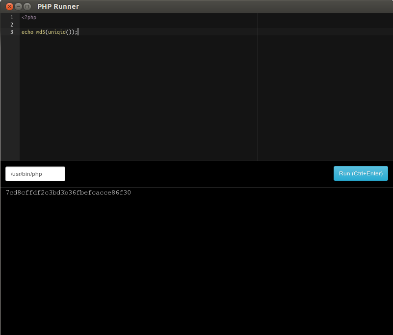

# nw-phprunner

Simple desktop application to run PHP code effortlessly. Can be useful for debugging or testing purposes...



## Usage

* PHP-CLI should be installed on your environment.
* [node-webkit](https://github.com/rogerwang/node-webkit) is required
* Edit ```run.sh``` to fit your environment setup
* Run ```chmod +x run.sh``` 
* Finally open the App: ```./run.sh```